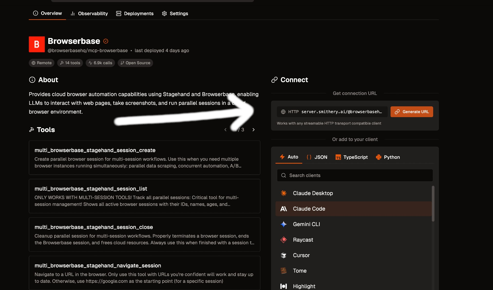

## Quick Installation

<Card title="Install with Cursor" icon="arrow-pointer" href="cursor://anysphere.cursor-deeplink/mcp/install?name=browserbase&config=eyJjb21tYW5kIjoibnB4IEBicm93c2VyYmFzZWhxL21jcCIsImVudiI6eyJCUk9XU0VSQkFTRV9BUElfS0VZIjoiIiwiQlJPV1NFUkJBU0VfUFJPSkVDVF9JRCI6IiIsIkdFTUlOSV9BUElfS0VZIjoiIn19">
One-click installation directly in Cursor with pre-configured settings
</Card>

We support multiple transport methods for our MCP server: STDIO and SHTTP. We recommend using SHTTP with our remote hosted URL to take advantage of the server at full capacity.

## Prerequisites

<Steps>
<Step title="Get your Browserbase credentials">
Get your Browserbase API key and project ID from the [Browserbase Dashboard](https://www.browserbase.com/overview).

<Frame>

</Frame>

Then copy your API Key and Project ID directly from the input.
</Step>
</Steps>

## Installation Methods

<Tabs>
<Tab title="Remote URL (SHTTP)">

Go to [smithery.ai](https://smithery.ai/server/@browserbasehq/mcp-browserbase) and enter your API keys and configuration to get a remote hosted URL.



<CodeGroup>
```json Smithery
{
  "mcpServers": {
    "browserbase": {
      "url": "your-smithery-url.com"
    }
  }
}
```
</CodeGroup>

When using our remote hosted server, we provide the LLM costs for Gemini, the [best performing model](https://www.stagehand.dev/evals) in [Stagehand](https://www.stagehand.dev).

</Tab>

<Tab title="NPM Package (STDIO)">
The easiest way to get started locally is using our NPM package.

<Note>
If you would like to use a different model, you have to pass the model name and keys in the args. More info [here](https://docs.browserbase.com/integrations/mcp/configuration).
</Note>

<Steps>
<Step title="Add to MCP Config">
Go into your MCP Config JSON and add the Browserbase Server:

<CodeGroup>
```json Claude Desktop
{
  "mcpServers": {
    "browserbase": {
      "command": "npx",
      "args": ["@browserbasehq/mcp"],
      "env": {
        "BROWSERBASE_API_KEY": "your_api_key",
        "BROWSERBASE_PROJECT_ID": "your_project_id",
        "GEMINI_API_KEY": "your_gemini_api_key"
      }
    }
  }
}
```
</CodeGroup>
</Step>

<Step title="Restart your MCP client">
<Check>
That's it! Reload your MCP client and Claude will be able to use Browserbase.
</Check>
</Step>
</Steps>
</Tab>

<Tab title="Local Development">
For local development or customization, you can run the server locally.

<Steps>
<Step title="Clone and build">
```bash
# Clone the Repo
git clone https://github.com/browserbase/mcp-server-browserbase.git
cd mcp-server-browserbase

# Install the dependencies and build the project
npm install && npm run build
```
</Step>

<Step title="Choose your transport method">
You can run locally using either STDIO or Streamable HTTP (SHTTP).

<Tabs>
<Tab title="STDIO">
Add the following to your MCP Config JSON file:

```json
{
  "mcpServers": {
    "browserbase": {
      "command": "node",
      "args": ["/path/to/mcp-server-browserbase/cli.js"],
      "env": {
        "BROWSERBASE_API_KEY": "your_api_key",
        "BROWSERBASE_PROJECT_ID": "your_project_id",
        "GEMINI_API_KEY": "your_gemini_api_key"
      }
    }
  }
}
```
</Tab>

<Tab title="SHTTP (Self-hosted)">
First, run the server:

```bash
node cli.js --port 8931
```

Then add this to your MCP Config JSON file:

```json
{
  "mcpServers": {
    "browserbase": {
      "url": "http://localhost:8931/mcp",
      "env": {
        "BROWSERBASE_API_KEY": "your_api_key",
        "BROWSERBASE_PROJECT_ID": "your_project_id",
        "GEMINI_API_KEY": "your_gemini_api_key"
      }
    }
  }
}
```
</Tab>
</Tabs>
</Step>

<Step title="Restart your client">
<Check>
Reload your MCP client and you should be good to go!
</Check>
</Step>
</Steps>
</Tab>
</Tabs>

## Verify Installation

<Steps>
<Step title="Restart your Claude Client">
Restart/refresh your Claude Client app and you should see the tools available by clicking the 🔨 icon.
</Step>

<Step title="Test the integration">
Get started using our MCP Server by asking Claude to navigate to any page and see your Browserbase Browser in action on the [dashboard](https://www.browserbase.com/sessions).

<Tip>
Try asking Claude: "Navigate to google.com and take a screenshot"
</Tip>
</Step>
</Steps>

## Further Reading

<CardGroup cols={3}>
<Card title="Model Context Protocol (MCP) Docs" icon="book" href="https://modelcontextprotocol.io/introduction">
Learn more about the MCP protocol
</Card>

<Card title="Browserbase Documentation" icon="globe" href="https://docs.browserbase.com">
Explore Browserbase features and capabilities
</Card>

<Card title="Support" icon="headset" href="mailto:support@browserbase.com">
Get help from our support team
</Card>
</CardGroup>